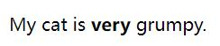
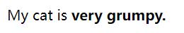
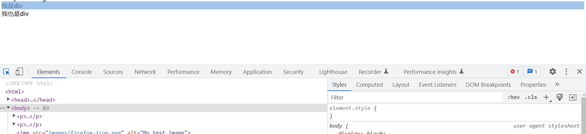
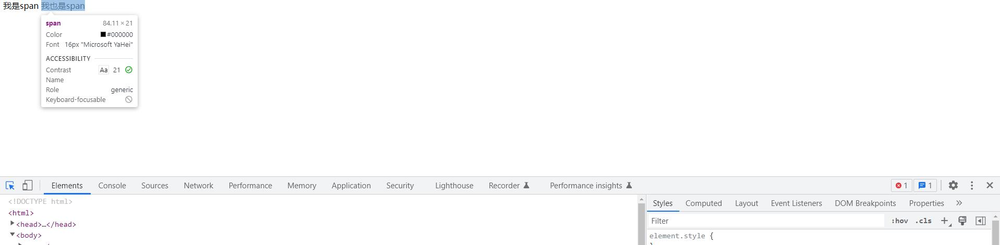

# WTF HTML极简教程: 2. Element

WTF HTML教程，总结/搬运自[MDN HTML教程](https://developer.mozilla.org/zh-CN/docs/Learn/HTML)，帮助新人快速入门HTML。

**推特**：[@WTFAcademy_](https://twitter.com/WTFAcademy_)  ｜ [@0xAA_Science](https://twitter.com/0xAA_Science) 

**WTF Academy社群：** [官网 wtf.academy](https://wtf.academy) | [WTF Solidity教程](https://github.com/AmazingAng/WTFSolidity) | [discord](https://discord.wtf.academy) | [微信群申请](https://docs.google.com/forms/d/e/1FAIpQLSe4KGT8Sh6sJ7hedQRuIYirOoZK_85miz3dw7vA1-YjodgJ-A/viewform?usp=sf_link)

所有代码和教程开源在github: [github.com/WTFAcademy/WTF-HTML](https://github.com/WTFAcademy/WTF-HTML)

---

这一讲，我们将在上一讲的基础上，具体分析HTML中的元素。


## 元素的属性

元素也可以有属性(Attribute):


属性包含了关于元素的一些额外信息，这些信息本身不应显现在内容中。本例中，`class`是属性名称，`editor-note`是属性的值。`class`属性可为元素提供一个标识名称，以便进一步为元素指定样式或进行其他操作时使用。

属性应该包含：

1. 在属性与元素名称（或上一个属性，如果有超过一个属性的话）之间的空格符。
2. 属性的名称，并接上一个等号。
3. 由引号所包围的属性值。

常用的属性：

1. `id`:为元素提供一个唯一标识符。
2. `class`：为元素提供一个或多个类名，不同的元素可以添加相同的类名。
3. `style`:为元素提供内联样式。

**备注**： 不包含 ASCII 空格(以及`"` `'` `=` `<` `>`)的简单属性值可以不使用引号，但是建议将所有属性值用引号括起来，这样的代码一致性更佳，更易于阅读。

## 嵌套元素

也可以将一个元素置于其他元素之中 —— 称作**嵌套**。要表明猫咪非常暴躁，可以将`very`用`<strong>`元素包围，`very`将突出显示：

```html
<p>My cat is <strong>very</strong> grumpy.</p>
```
页面效果：



必须保证元素嵌套次序正确：本例首先使用`<p>`标签，然后是`<strong>`标签，因此要先结束`<strong>`标签，最后再结束`<p>`标签。这样是不对的：

```html
<p>My cat is <strong>very grumpy.</p></strong>
```

页面效果：



因此元素必须正确地开始和结束，才能清楚地显示出正确的嵌套层次。否则浏览器就得自己猜测，虽然它会竭尽全力，但很大程度不会给你期望的结果。所以一定要避免！

## 空元素

不包含任何内容的元素称为空元素。比如``元素：

```html

```

本元素包含两个属性，但是并没有`</img>`结束标签，元素里也没有内容。这是因为图像元素不需要通过内容来产生效果，它的作用是向其所在的位置嵌入一个图像。

## 块级元素

块级元素的特点是：

1. 独占一行
2. 元素的宽高可以设置
3. 默认宽度是它父容器的100%

```html
<div>我是div</div>
<div>我也是div</div>
```



常见的块级元素有：div、table、form、h1-h6、p、ul、ol

## 行内元素

行内元素的特点是：

1. 可以与相邻的行内元素排列在同一行
2. 元素的宽高不可设置
3. 元素宽度会被内容撑开

```html
<span>我是span</span>
<span>我也是span</span>
```



常见的行内元素有：span、a、strong、em、img、input

## 总结

这一讲我们具体分析了HTML中的元素，包括元素的属性、嵌套元素、空元素、块级元素和行内元素。更详细内容你可以阅读[MDN HTML基础](https://developer.mozilla.org/zh-CN/docs/Learn/Getting_started_with_the_web/HTML_basics)。
