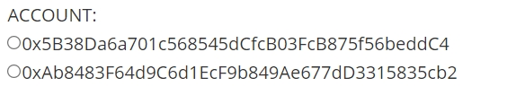
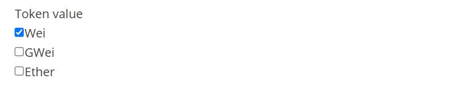

# WTF HTML极简教程: 5. 表单

WTF HTML教程，总结/搬运自[MDN HTML教程](https://developer.mozilla.org/zh-CN/docs/Learn/HTML)，帮助新人快速入门HTML。

**推特**：[@WTFAcademy_](https://twitter.com/WTFAcademy_)  ｜ [@0xAA_Science](https://twitter.com/0xAA_Science)

**WTF Academy社群：** [官网 wtf.academy](https://wtf.academy) | [WTF Solidity教程](https://github.com/AmazingAng/WTFSolidity) | [discord](https://discord.wtf.academy) | [微信群申请](https://docs.google.com/forms/d/e/1FAIpQLSe4KGT8Sh6sJ7hedQRuIYirOoZK_85miz3dw7vA1-YjodgJ-A/viewform?usp=sf_link)

所有代码和教程开源在github: [github.com/WTFAcademy/WTF-HTML](https://github.com/WTFAcademy/WTF-HTML)

---

这一讲，我们介绍HTML的常用元素之一：[表单](https://developer.mozilla.org/zh-CN/docs/Web/HTML/Element/form)。

## 基本概念

表单常用于收集用户的输入信息，并发送至web服务器，实现网页与用户的交互。

表单使用 `<form>` 创建，内嵌表单的输入内容，可以包含例如文本域、下拉选择框（select）、单选框（radio-buttons）、复选框（checkbox）等元素，以下将逐一介绍。

## 常见的表单元素

### 文本域（Text Fields）

[文本域](https://developer.mozilla.org/zh-CN/docs/Web/HTML/Element/Input)使用 **`<input type="text">`** 设定，用户可以在文本域中输入具体文本内容。

示例如下：

```html
<form>
First name: <input type="text" name="firstname"><br>
Last name: <input type="text" name="lastname">
</form>
```

浏览器展示：


### 密码（Password）

密码通过标签 **`<input type="password">`** 来定义，密码字段不会明文展示，而使用圆点替代。

示例如下：

```html
<form>
Password: <input type="password" name="pwd">
</form>
```

浏览器展示：


### 单选按钮（Radio Buttons）

单选框通过 **`<input type="radio">`** 标签定义

示例如下：

```html
<form action="">
ACCOUNT:
<input type="radio" name="address" value="addr1">0x5B38Da6a701c568545dCfcB03FcB875f56beddC4<br>
<input type="radio" name="address" value="addr2">0xAb8483F64d9C6d1EcF9b849Ae677dD3315835cb2
</form>
```

浏览器展示：



### 下拉选择框（select）

[下拉选择框](https://developer.mozilla.org/zh-CN/docs/Web/HTML/Element/select)使用 `<select>` 和 `<option>`定义

示例如下：

```html
<form action="">
  Contract
  <select>
    <option>Facucet.sol</option>
    <option>ERC20.sol</option>
    <option>ERC721.sol</option>
  </select>
</form>
```

浏览器展示：


### 复选框（Checkboxes）

复选框可以选取一个或多个选项，使用 **`<input type="checkbox">`** 定义

示例如下：

```html
<form>
  Token value <br>
  <input type="checkbox" name="token_value" value="Wei">Wei<br>
  <input type="checkbox" name="token_value" value="GWei">GWei<br>
  <input type="checkbox" name="token_value" value="Ether">Ether<br>
</form>
```

浏览器展示：



### 提交按钮(Submit)

当用户单击确认按钮时，表单的内容会被传送到服务器, 使用 **`<input type="submit">`** 定义。

示例如下：

```html
<form name="input" action="action.php" method="get">
  <input type="submit" value="Deploy">
  <input type="text" name="user" placeholder='address'>
</form>
```

示例中还涉及到form常见的几个元素属性，分别是：

name：表单的名称。该值不能是空字符串，并且在它所在的表单集合中需要是唯一的

**action** ：指定表单内容的送达地址，实现对输入数据的处理

method：定义表单数据的提交方式，可以是以下值：

* **post**：HTTP POST 方法，表单数据会包含在表单体内发送给服务器，可以用于提交敏感数据，如用户名与密码等
* **get**：默认值， HTTP GET 方法，表单数据会附加在 **action** 属性的 URL 中，并以 **?** 作为分隔符，一般用于不敏感信息，如分页等。例如：https://www.wtfacademy.com/?currentPage=1，这里的 currentPage=1 就是 get 方法提交的数据

浏览器展示：


## 总结

这一讲我们介绍了HTML常用元素表单以及其常见的表单元素。更详细内容你可以阅读[MDN HTML基础](https://developer.mozilla.org/zh-CN/docs/Learn/HTML/Tables)。
