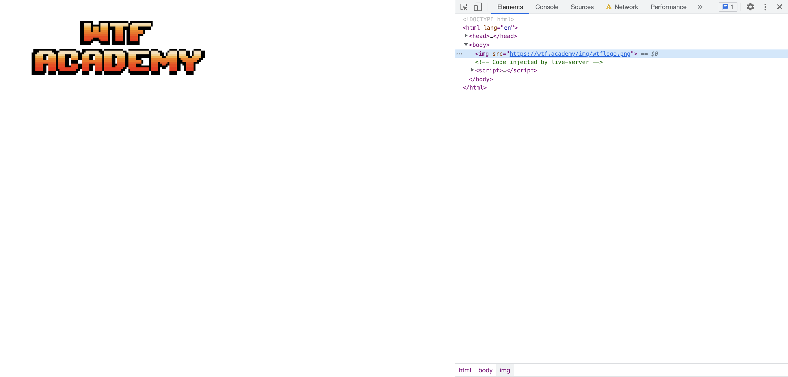

# WTF HTML 极简教程: 7. 图像

WTF HTML 教程，总结/搬运自[MDN HTML 教程](<(https://developer.mozilla.org/zh-CN/docs/Learn/HTML)>)，帮助新人快速入门 HTML。

**推特**：[@WTFAcademy_](https://twitter.com/WTFAcademy_) ｜ [@0xAA_Science](https://twitter.com/0xAA_Science)

**WTF Academy 社群：** [官网 wtf.academy](https://wtf.academy) | [WTF Solidity 教程](https://github.com/AmazingAng/WTFSolidity) | [discord](https://discord.wtf.academy) | [微信群申请](https://docs.google.com/forms/d/e/1FAIpQLSe4KGT8Sh6sJ7hedQRuIYirOoZK_85miz3dw7vA1-YjodgJ-A/viewform?usp=sf_link)

所有代码和教程开源在 github: [github.com/WTFAcademy/WTF-HTML](https://github.com/WTFAcademy/WTF-HTML)

---

在网页中图像随处可见，小到网页的 Logo，大到网页的背景，都可以使用图像。这一讲，我们来详细介绍 `` 图像元素。

## ``：图像嵌入元素

在 HTML 中，使用 `` 元素可以将图像嵌入到页面中。



它的用法是：

```html

```

### `src` 属性是必须的，它包含了你想嵌入的图像的文件路径。

例如我们想像上图一样在页面中展示 WTFAcademy logo。

```html

```

### `alt` 属性用来为图像定义一条文本描述。

`alt` 属性是不是必须的，它可以让浏览器无法载入图像时，展示 `alt` 属性中所写的文本描述。它的另一个用处是对于无障碍而言，屏幕阅读器会将这些描述读给需要使用阅读器的使用者听，让他们知道图像的含义。

> **浏览器并非总是会显示图像，比如：**
> 1. 非可视化浏览器（Non-visual browsers）（比如有视力障碍的人使用的音频浏览器）
> 2. 用户选择不显示图像（比如为了节省带宽，或出于隐私等考虑不加载包括图片在内的第三方资源文件）
> 3. 图像文件无效，或是使用了不支持的格式在这些情况下，浏览器很可能会将图像替换为图像所属 `` 元素的 alt 属性所提供的文本。
> 4. ......

```html
// 这是一个错误链接，它在页面中的效果如下图所示

```


所以我们在使用 `img` 标签时通常都会加上 alt 属性。


### `width` 与 `height` 属性

height（高度）与 width（宽度）属性用于设置图像的高度与宽度，属性值默认单位为像素（px）。

```html
// 设置图像大小为 1200px * 510px

```

给图片设置宽度与高度的好处是，在页面加载的时会保留指定的尺寸，以确保图像被加载之前页面的布局是稳定的。
不过我们通常不会在 `` 元素中直接设置宽度与高度，后续学习过CSS后，我们一般通过CSS来指定图像的宽度与高度。

## 总结
这一讲我们学习了如何通过img标签在页面中嵌入图像，以及它的常用属性。更详细内容你可以阅读[MDN HTML基础](https://developer.mozilla.org/zh-CN/docs/Learn/HTML/Multimedia_and_embedding/Images_in_HTML)。