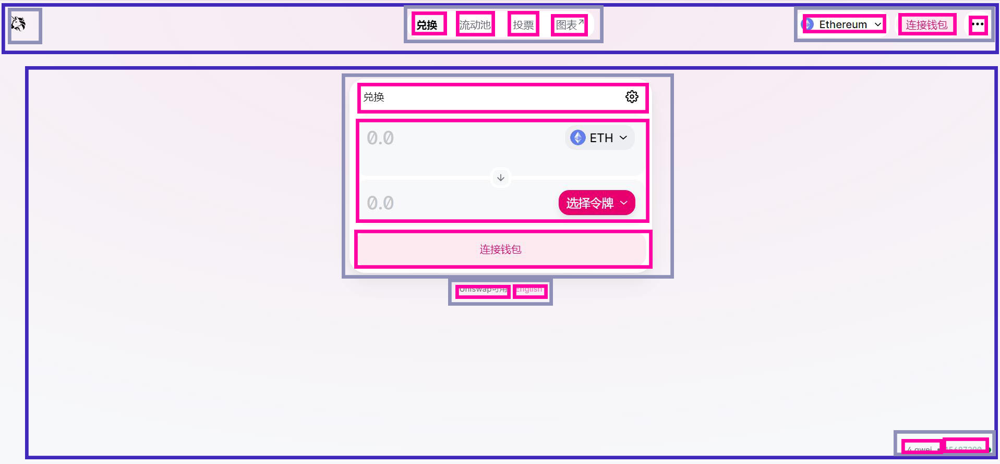
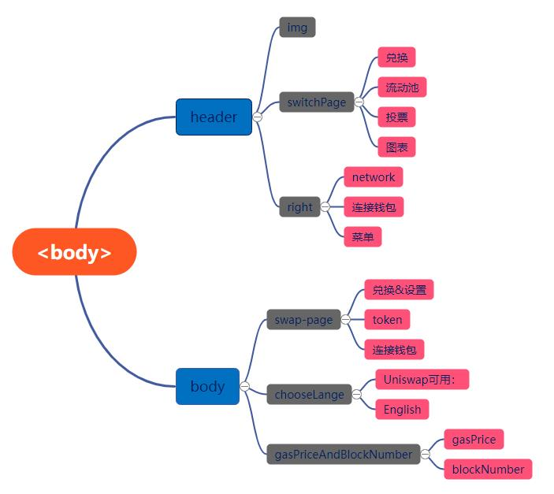

# WTF HTML极简教程: 13. Uniswap页面

WTF HTML教程，帮助新人快速入门HTML。

**推特**：[@WTFAcademy_](https://twitter.com/WTFAcademy_)  ｜ [@0xAA_Science](https://twitter.com/0xAA_Science) 

**WTF Academy社群：** [官网 wtf.academy](https://wtf.academy) | [WTF Solidity教程](https://github.com/AmazingAng/WTFSolidity) | [discord](https://discord.gg/5akcruXrsk) | [微信群申请](https://docs.google.com/forms/d/e/1FAIpQLSe4KGT8Sh6sJ7hedQRuIYirOoZK_85miz3dw7vA1-YjodgJ-A/viewform?usp=sf_link)

所有代码和教程开源在github: [github.com/WTFAcademy/WTF-HTML](https://github.com/WTFAcademy/WTF-HTML)

---

这一讲，我们将对前 8 讲的知识进行组合应用，并编写去中心化交易所 [Uniswap](https://app.uniswap.org) 的极简HTML页面

>Uniswap前端页面是用React编写的，在此我们降低难度用HTML编写。


## 分析页面结构

HTML文件决定了页面的结构，因此当我们拿到一个页面后，在编写前首先要分析它的结构。


我们可以将Uniswap的页面拆分成如下结构（相同颜色的框为同一级）：



然后我们就可以画出该页面的结构树：



得到结构树后页面的结构就十分清晰了，下面我们就开始编写代码。

## 编写代码

### `<head>`

在 `<head>` 中我们可以设置页面的 `title` 和图标。

```html
<link rel="icon" href="./img/icon.png">
<title>Uniswap Interface</title>
```

### 头部结构

首先我们处理头部的结构，头部里包含三个子元素。左边只有一个icon，中间是切换页面的超链接，四个超链接用一个`div`包裹，右边有网络、连接钱包按钮和菜单按钮，这三个元素也用一个`div`包裹。网络里面包含了ETH的`img`和`span`。

```html
<header>
    
    <div class="switchPage">
        <a>兑换</a>
        <a>流动池</a>
        <a>投票</a>
        <a>图标</a>
    </div>
    <div class="right">
        <span class="changeNetwork">
            
            <span>Ethereum</span>
        </span>
        <button>连接钱包</button>
        <button>···</button>
    </div>
</header>
```

> Tips: 在复杂页面中，我们可以用 HTML `class` 属性来指定元素的类，之后 `CSS` 和 `JavaScript` 可以通过它来访问和操作具有特定类名的元素。

页面效果如下：


### 中间结构

然后是中间部分，中间部分也包含三个直接相邻的子元素，分别是交换 token 的页面、选择语言和右下角的 gasFee 和 blockNumber 。

兑换 token 的页面比较复杂，它里面还有设置、选择token、连接钱包三个部分。

设置里面包含了一个内容为 `兑换` 的 `span` 和一个用于改变设置的`button`，`button`中包含一个`img`。

```html
<div class="swap-page-header">
    <span>兑换</span>
    <button>
        
    </button>
</div>
```
选择token这部分上下代码是差不多的，我们只需要分析一半即可。

上半部分包含了一个`input`和一个`button`，`button`里面包含了ETH的`img`和`span`,这两个元素可以用一个`div`包裹起来，`class`设置为`token-info`。

```html
<div class="token1">
    <input type="text" inputmode="decimal" placeholder="0.0">
    <button>
        <div class="token-info">
            
            <span>ETH</span>
        </div>
    </button>
</div>
```

最下面连接钱包的结构比较简单，里面只有一个`button`。

```html
<div class="swap-page-footer">
    <button>连接钱包</button>
</div>
```

选择语言部分包含了一个`span`和一个超链接，用于改变页面的语言，超链接的`href`需要填写一个英文版的Uniswap网页链接，在此我们就不填。

```html
<div class="chooseLanguage">
    <span>Uniswap可用：</span>
    <a href="">English</a>
</div>
```

gasFee和blockNumber部分包含了两个超链接，用于跳转到相应的 etherscan 页面。第二个超链接的`href`是由 JavaScript 动态调整的，在此我们就不填。同时两个超链接中的内容也是由 JavaScript 动态输入的，在此我们暂时先填入固定的数值。

```html
<div class="gasPriceAndBlockNumber">
    <a href="https://etherscan.io/gastracker">3 gwei</a>
    <a href="">15687194</a>
</div>
```

到此Uniswap的极简HTML页面代码就写完了，我们可以在页面中打开查看效果。


可以看到，我们的页面是非常丑陋的，同时基本上没有任何功能，这需要我们后期再给它加上 CSS 和 JavaScript。

## 习题

修改 HTML 代码，将极简 Uniswap 页面改为 [SushiSwap](https://www.sushi.com/swap) 页面。


## 总结

这一讲我们用前8讲所学的 HTML 知识编写出了一个 Uniswap 的极简 HTML 页面。我们将在之后的 `WTF-CSS` 和 `WTF-JavaScript` 中继续完善它。
