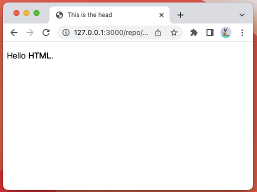

# WTF HTML minimalist tutorial: 1. Hello HTML (9 lines of code)

WTF HTML tutorial helps newcomers get started with HTML quickly.

**Twitter**: [@WTFAcademy_](https://twitter.com/WTFAcademy_) | [@0xAA_Science](https://twitter.com/0xAA_Science)

**WTF Academy Community:** [Official website wtf.academy](https://wtf.academy) | [WTF Solidity Tutorial](https://github.com/AmazingAng/WTFSolidity) | [discord](https: //discord.gg/5akcruXrsk) | [WeChat group application](https://docs.google.com/forms/d/e/1FAIpQLSe4KGT8Sh6sJ7hedQRuIYirOoZK_85miz3dw7vA1-YjodgJ-A/viewform?usp=sf_link)

All codes and tutorials are open source on github: [github.com/WTFAcademy/WTF-HTML](https://github.com/WTFAcademy/WTF-HTML)

---

In this lecture, we introduce the basics of HTML and write the first HTML program: Hello HTML (9 lines of code). You can also read directly [MDN HTML Basics](https://developer.mozilla.org/zh-CN/docs/Learn/Getting_started_with_the_web/HTML_basics).


## What is HTML?

The Internet, or more specifically the World Wide Web, is made up of many documents and resources that are linked together. These documents and resources are written in HTML (**H**yper**t**ext **M**arkup **L**anguage, Hypertext Markup Language), and they are called web pages. HTML is the basis of web pages and defines the structure and content of web pages.

When you enter a URL (for example, www.example.com) into your browser, the browser sends a request to the server that serves the page. The server will respond to this request and send the requested web page (that is, some HTML) back to the browser. The browser then parses this HTML and displays it as the web pages you normally see.

HTML is not a programming language, but a markup language used to define the structure of content. HTML consists of a series of elements that can be used to surround different parts of content and make it appear or work in a certain way. A pair of tags (`tag`) can add a hyperlink to a piece of text or an image, italicize the text, change the font size, etc. For example:

```plain
My cat is very grumpy
```

You can encapsulate this line of text into a paragraph (**p**aragraph) element to render it on a single line:

```html
<p>My cat is very grumpy</p>
```

## The difference between HTML, CSS and JavaScript

- **HTML**: HTML is used to define the structure and content of web pages. It consists of a series of elements, which can include text, links, images, etc.

- **CSS**: CSS (Cascading Style Sheets, cascading style sheets) is a style sheet language used to describe the style of HTML elements, including colors, layouts, fonts, etc. CSS can make your web page look more beautiful and can also implement responsive design so that your web page looks good on different devices.

- **JavaScript**: JavaScript is a programming language that makes web pages interactive. For example, JavaScript can make web pages respond to user actions, such as clicking buttons, submitting forms, etc.

## HTML elements

HTML documents are composed of HTML elements. HTML elements consist of tags, content and closing tags. For example, a paragraph element looks like this:

```html
<p>This is a paragraph.</p>
```

Effect in browser:

<p>This is a paragraph.</p>


In this example, `<p>` is the opening tag, `This is a paragraph.` is the content, and `</p>` is the closing tag.

HTML elements can have attributes, which provide additional information about the element. For example, a link element looks like this:

```html
<a href="https://www.example.com">This is a link</a>
```

Effect in browser:

<a href="https://www.example.com">This is a link</a>

In this example, `href` is an attribute that specifies the target address of the link.

## development tools

We recommend that you use [VSCode](https://code.visualstudio.com/download) to develop HTML, and use a browser (Chrome) to open the `.html` file for browsing.

## Hello HTML

Now we are going to write our first HTML program: Hello HTML (9 lines of code) and see how the individual elements cooperate with each other to form a complete HTML page.

```html
<!DOCTYPE html>
<html>
   <head>
     <title>This is the head</title>
   </head>
   <body>
     <p>Hello <strong>HTML</strong>.</p>
   </body>
</html>
```



Hello HTML includes the following elements:

- `<!DOCTYPE html>` — document type, ensuring that the document can be read normally. .
- `<html></html>` — The `html` element, which contains the content of the entire page, is also called the root element.
- `<head></head>` — The `head` element, whose content is invisible to users, contains, for example, search keywords for search engines, page descriptions, CSS style sheets, and character encoding declarations.
- `<title></title>` — The `title` element. This element sets the title of the page, which is displayed on the browser tab and also serves as the description text of the favorite web page.
- `<body></body>` — The `body` element. This element contains the content you expect users to see when they visit the page, including text, images, videos, games, playable audio tracks, or other content.
- `<p></p>` - The paragraph element represents a paragraph of text, usually appearing as a block of text separated from adjacent text, either by vertical white space or by a first line indent.

## Summary

In this lecture, we introduced what HTML is, its elements and development tools, and wrote the first HTML program: Hello HTML.
