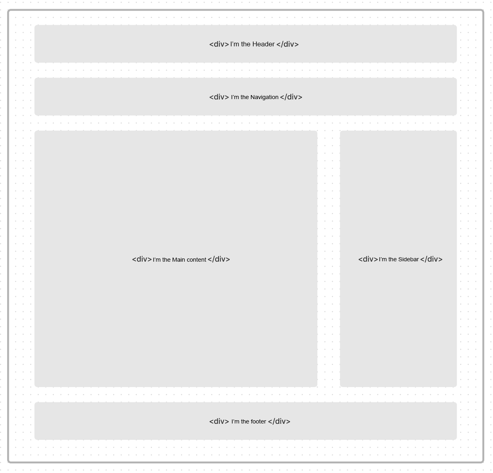
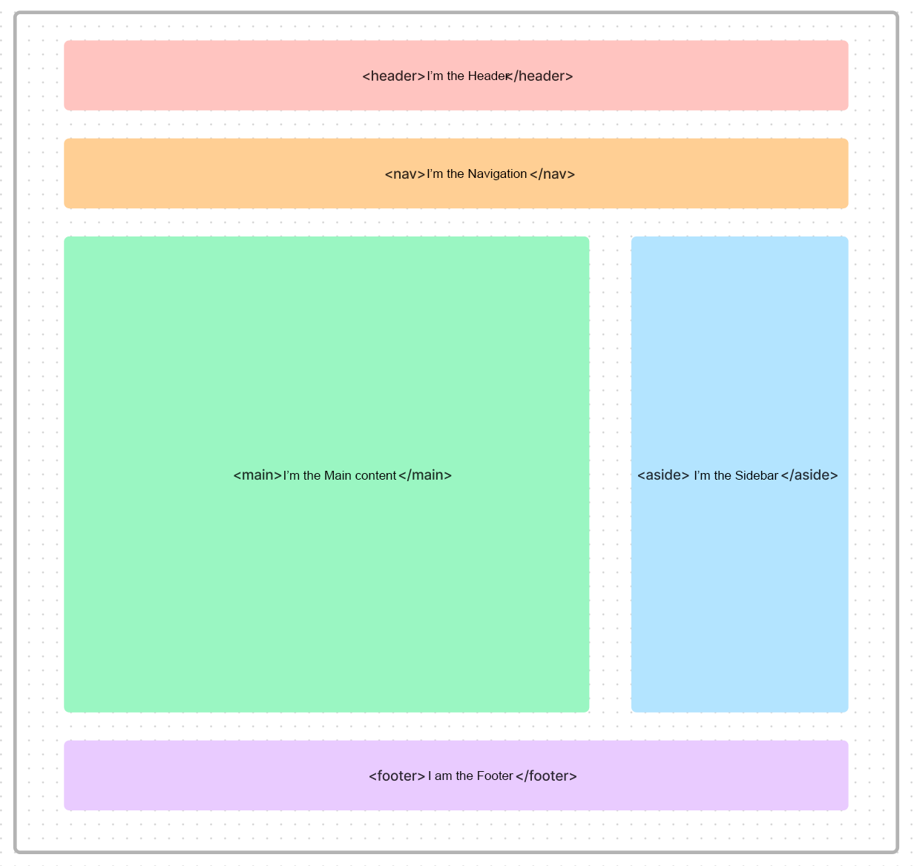

# WTF HTML minimalist tutorial: 8. Semantic elements

WTF HTML tutorial helps newcomers get started with HTML quickly.

**Twitter**: [@WTFAcademy_](https://twitter.com/WTFAcademy_) | [@0xAA_Science](https://twitter.com/0xAA_Science)

**WTF Academy Community:** [Official website wtf.academy](https://wtf.academy) | [WTF Solidity Tutorial](https://github.com/AmazingAng/WTFSolidity) | [discord](https: //discord.gg/5akcruXrsk) | [WeChat group application](https://docs.google.com/forms/d/e/1FAIpQLSe4KGT8Sh6sJ7hedQRuIYirOoZK_85miz3dw7vA1-YjodgJ-A/viewform?usp=sf_link)

All codes and tutorials are open source on github: [github.com/WTFAcademy/WTF-HTML](https://github.com/WTFAcademy/WTF-HTML)

---

Semantic HTML is about conveying the meaning and structure of content through the use of appropriate tags, which makes your code easier to read and understand, and also helps with search engine optimization (SEO). In HTML5, a new set of semantic tags are introduced that describe your content and page structure more clearly. In this chapter, we will introduce some common semantic tags.

## Common semantic elements:

### Text class:

A page structure usually includes: header, footer, title, navigation, content, sidebar, etc.

We can write the page like this, as shown in the figure below.



As shown in the picture above, you only need to use the `<div>` element to complete the layout of a page. Even text content, such as headings, paragraphs, etc., can be written using `<div>`.

But this will cause two obvious problems:
1. It is not conducive for developers to write code. When you are faced with `<div>` elements that fill the screen, it is difficult for you to quickly distinguish what they represent.
2. It is not conducive to search engine optimization (SEO). The browser only knows that you have used the `<div>` element, and the `div` element itself has no meaning, it is just a container.

At this time we can solve these two problems by using semantic elements, as shown in the figure below.



We used `<header>` `<nav>` `<main>` `<aside>` `<footer>` to represent different areas in the page respectively.

Using these tags gives the page good semantics and structure, making it easier for both developers and browsers to quickly understand the web content.

This does not mean that you cannot use the `<div>` element to write pages, but we can use some semantic elements to replace the `<div>` element for specific content on the page. This is what I said at the beginning, getting the right elements to do the right thing.

Let's briefly introduce these tags.

- `<header>` is used to display introductory content, usually containing a set of introductory or useful elements to aid navigation. It may contain some title elements, but it may also contain other elements such as a logo, search box, author name, etc.

- `<nav>` represents a portion of a page whose purpose is to provide navigation links within the current document or other documents. Common examples of navigation sections are menus, catalogs, and indexes.

- `<main>` renders the body of the document or the main part of the application. The main part consists of content that is directly related to the document or extends to the central theme of the document or the main functional parts of the application.

- `<aside>` represents a section that has little to do with the rest of the page content, is considered an independent part of the content and can be separated independently without affecting the whole. It usually appears as a sidebar or callout box.

- `<footer>` is usually used to represent the footer. A footer usually contains information about the section author, copyright data, or links to the document.

- `<address>` means that the HTML provides contact information for a person or organization (etc.).

- `<article>` represents a self-contained structure within a document, page, application or website that is intended to be independently assignable or reusable, e.g. in a publication, it might be a forum post, magazine or news article, Blogs, user-submitted comments, interactive components, or other independent items of content. ​​

- `<section>` represents a generic independent section in an HTML document that has no more specific semantic elements to represent it. Typically a title will be included.

For example:

```html
<header>
   <h1>Site Name</h1>
   <nav>
     <ul>
       <li><a href="/">Home</a></li>
       <li><a href="/about">About</a></li>
       <li><a href="/contact">Contact</a></li>
     </ul>
   </nav>
</header>

<main>
   <article>
     <h2>Blog Post Title</h2>
     <p>Blog post content...</p>
   </article>

   <aside>
     <h3>About the author</h3>
     <p>Author information...</p>
   </aside>
</main>

<footer>
   <p>&copy; 2023 Site Name</p>
</footer>
```

## Why do we need semantic elements?
1. More convenient for development. As mentioned above, the HTML code you write is easier to understand and more readable.
2. Facilitate parsing by other devices (such as screen readers, blind readers, mobile devices) to render web pages in a semantic manner.
3. Easier for SEO optimization. Compared with using non-semantic `<div>` tags, using semantics can make web pages more searchable by users.


## Summary

In this chapter, we introduce semantic HTML and some common semantic tags. By using semantic tags, you can create code that is more readable, easier to maintain, and search engine friendly.
