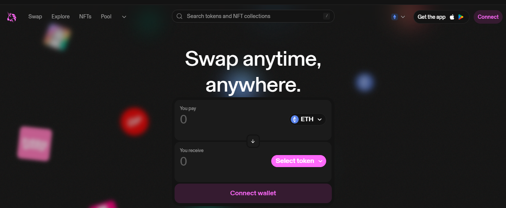
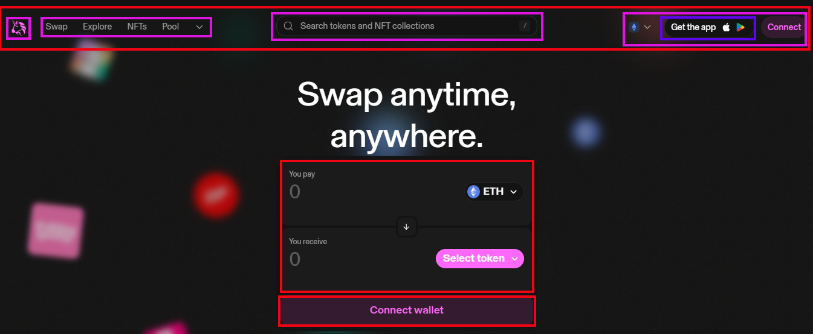
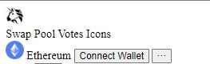
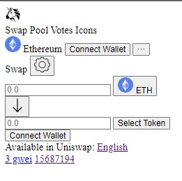
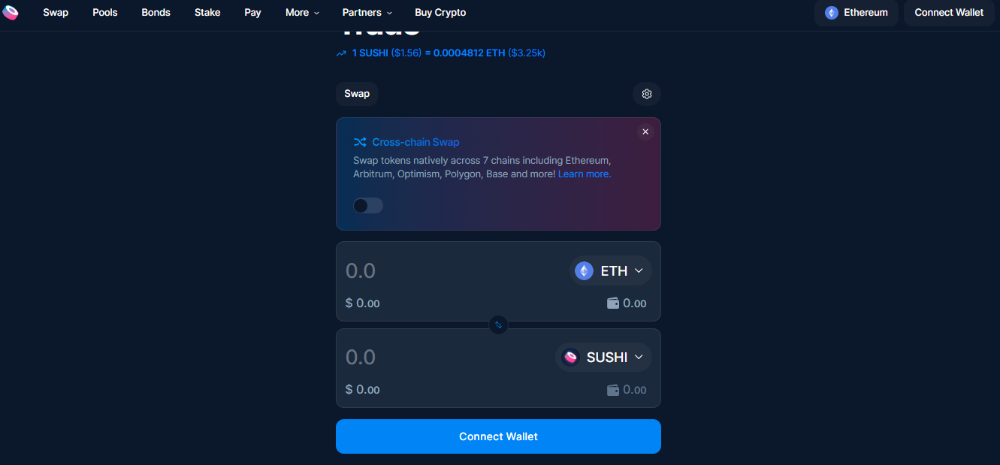

# WTF HTML minimalist tutorial: 9. Uniswap page

WTF HTML tutorial helps newcomers get started with HTML quickly.

**Twitter**: [@WTFAcademy_](https://twitter.com/WTFAcademy_) | [@0xAA_Science](https://twitter.com/0xAA_Science)

**WTF Academy Community:** [Official website wtf.academy](https://wtf.academy) | [WTF Solidity Tutorial](https://github.com/AmazingAng/WTFSolidity) | [discord](https: //discord.gg/5akcruXrsk) | [WeChat group application](https://docs.google.com/forms/d/e/1FAIpQLSe4KGT8Sh6sJ7hedQRuIYirOoZK_85miz3dw7vA1-YjodgJ-A/viewform?usp=sf_link)

All codes and tutorials are open source on github: [github.com/WTFAcademy/WTF-HTML](https://github.com/WTFAcademy/WTF-HTML)

---

In this lecture, we will combine and apply the knowledge from the previous 8 lectures and write a minimalist HTML page for the decentralized exchange [Uniswap](https://app.uniswap.org)

>Uniswap front-end page is written in React, here we reduce the difficulty and write it in HTML.


## Analyze page structure

The HTML file determines the structure of the page, so when we get a page, we must first analyze its structure before writing.



We can split the Uniswap page into the following structure (boxes of the same color are at the same level):



Then we can draw the structure tree of the page:


After getting the structure tree, the structure of the page will be very clear. Let's start writing code.

## Write code

### `<head>`

In `<head>` we can set the `title` and icon of the page.

```html
<link rel="icon" href="./img/icon.png">
<title>Uniswap Interface</title>
```

### Header structure

First we deal with the structure of the header, which contains three sub-elements. There is only one icon on the left, and a hyperlink for switching pages in the middle. The four hyperlinks are wrapped in a div. On the right, there are network, wallet connection buttons and menu buttons. These three elements are also wrapped in a div. The network contains `img` and `span` of ETH.

```html
<header>
     
     <div class="switchPage">
         <a>Exchange</a>
         <a>Liquidity pool</a>
         <a>Vote</a>
         <a>icon</a>
     </div>
     <div class="right">
         <span class="changeNetwork">
             
             <span>Ethereum</span>
         </span>
         <button>Connect wallet</button>
         <button>···</button>
     </div>
</header>
```

> Tips: In complex pages, we can use the HTML `class` attribute to specify the class of the element, and then `CSS` and `JavaScript` can use it to access and operate elements with specific class names.

The page effect is as follows:



### Intermediate structure

Then there is the middle part, which also contains three directly adjacent sub-elements, namely the page for exchanging tokens, the language selection and gasFee and blockNumber in the lower right corner.

The page for redeeming tokens is relatively complicated. It has three parts: settings, token selection, and wallet connection.

The settings contain a `span` with the content `redeem` and a `button` used to change the settings. `button` contains an `img`.

```html
<div class="swap-page-header">
     <span>Redeem</span>
     <button>
         
     </button>
</div>
```
The code for selecting the token is almost the same, we only need to analyze half of it.

The upper part contains an `input` and a `button`. `button` contains `img` and `span` of ETH. These two elements can be wrapped with a `div` and `class` is set to` token-info`.

```html
<div class="token1">
     <input type="text" inputmode="decimal" placeholder="0.0">
     <button>
         <div class="token-info">
             
             <span>ETH</span>
         </div>
     </button>
</div>
```

The structure connected to the wallet at the bottom is relatively simple, with only one `button` inside.

```html
<div class="swap-page-footer">
     <button>Connect wallet</button>
</div>
```

The language selection part contains a `span` and a hyperlink, which is used to change the language of the page. The `href` of the hyperlink needs to fill in an English version of the Uniswap web page link, which we will not fill in here.

```html
<div class="chooseLanguage">
     <span>Uniswap is available:</span>
     <a href="">English</a>
</div>
```

The gasFee and blockNumber parts contain two hyperlinks for jumping to the corresponding etherscan page. The `href` of the second hyperlink is dynamically adjusted by JavaScript, so we will not fill it in here. At the same time, the contents of the two hyperlinks are also dynamically input by JavaScript. Here we fill in fixed values ​​for the time being.

```html
<div class="gasPriceAndBlockNumber">
     <a href="https://etherscan.io/gastracker">3 gwei</a>
     <a href="">15687194</a>
</div>
```

At this point, Uniswap’s minimalist HTML page code has been written, and we can open it in the page to view the effect.



As you can see, our page is very ugly and basically has no functions. This requires us to add CSS and JavaScript to it later.

## Exercises

Modify the HTML code and change the minimalist Uniswap page to the [SushiSwap](https://www.sushi.com/swap) page.



## Summary

In this lecture, we use the HTML knowledge learned in the previous 8 lectures to write a minimalist HTML page for Uniswap. We will continue to improve it in `WTF-CSS` and `WTF-JavaScript` later.
