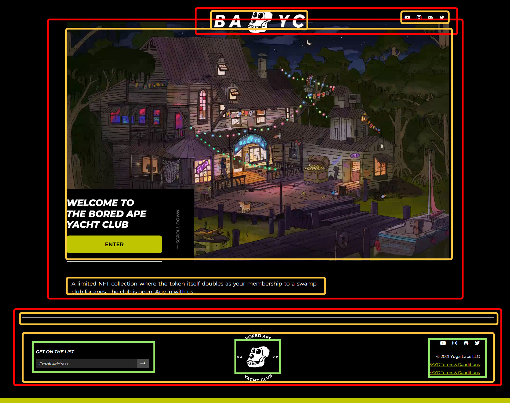
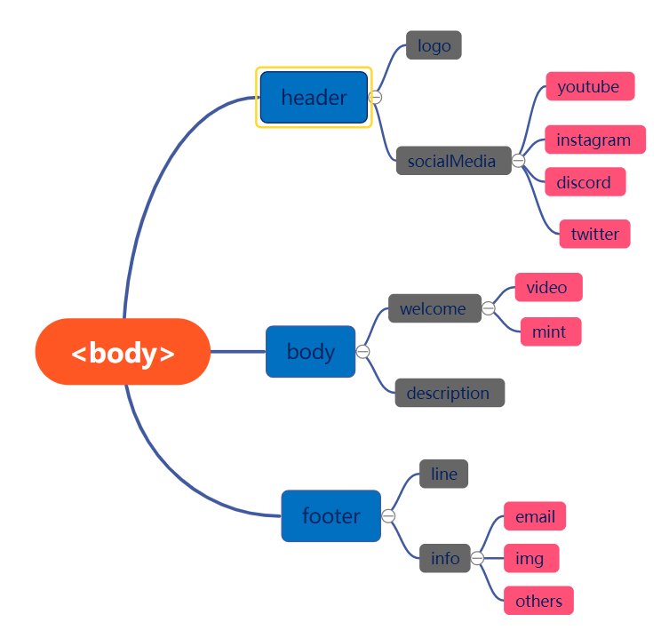
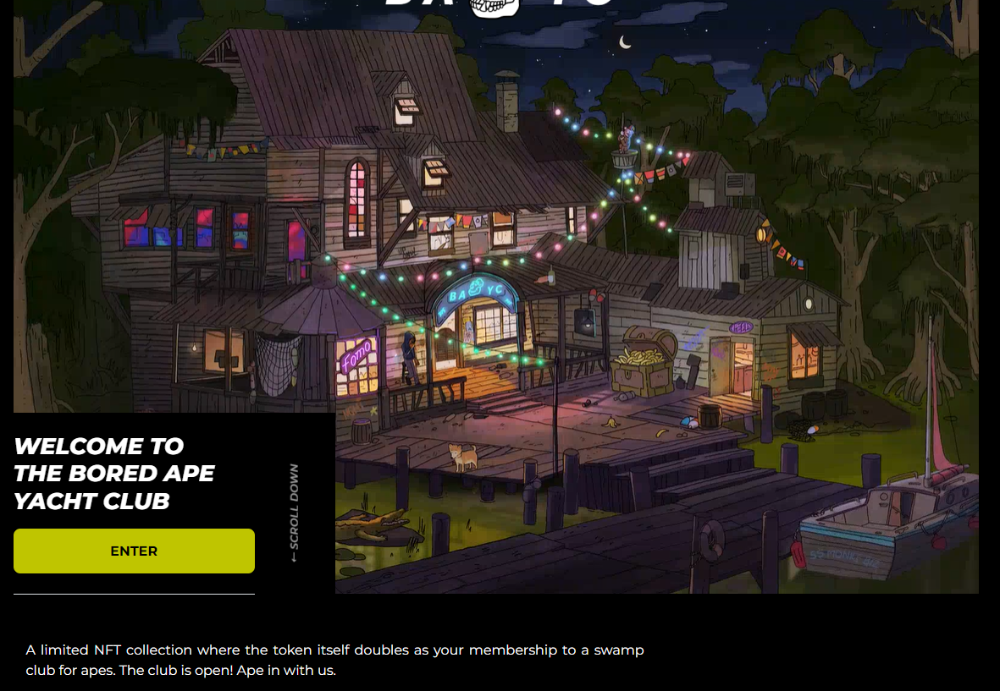
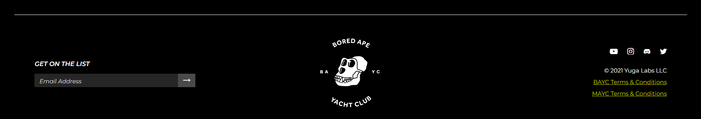

# WTF HTML minimalist tutorial: 14. BAYC official website

WTF HTML tutorial helps newcomers get started with HTML quickly.

**Twitter**: [@WTFAcademy_](https://twitter.com/WTFAcademy_) | [@0xAA_Science](https://twitter.com/0xAA_Science)

**WTF Academy Community:** [Official website wtf.academy](https://wtf.academy) | [WTF Solidity Tutorial](https://github.com/AmazingAng/WTFSolidity) | [discord](https: //discord.gg/5akcruXrsk) | [WeChat group application](https://docs.google.com/forms/d/e/1FAIpQLSe4KGT8Sh6sJ7hedQRuIYirOoZK_85miz3dw7vA1-YjodgJ-A/viewform?usp=sf_link)

All codes and tutorials are open source on github: [github.com/WTFAcademy/WTF-HTML](https://github.com/WTFAcademy/WTF-HTML)

---

In this lecture, we will write a minimalist HTML page for [BAYC official website](https://boredapeyachtclub.com/)

>BAYC official website is also written in React. Here we reduce the difficulty and write it in HTML.

## Analyze page structure

The HTML file determines the structure of the page, so when we get a page, we must first analyze its structure before writing.


We can split the Uniswap page into the following structure (boxes of the same color are at the same level):



Then we can draw the structure tree of the page:



After getting the structure tree, the structure of the page will be very clear. Let's start writing code.

## Write code

### `<head>`

In `<head>` we can set the `title` and icon of the page.

```html
     <link rel="icon" href="./img/icon.png">
     <title>BAYC</title>
```
### Header structure


First we deal with the header structure. This part includes a bayc-logo and social media. The social media are all contained in a `div` with a class name of `socialMedia`. The structure of each social media is a nested `a` an `img`

```html
     <div class="header">
         
         <div class="socialMedia">
             <a href="https://www.youtube.com/channel/UCB6R9NAjkgxQi_QEkc4O25Q">
                 
             </a>
             <a href="https://boredapeyachtclub.com/#/">
                 
             </a>
             <a href="https://discord.com/invite/3P5K3dzgdB">
                 
             </a>
             <a href="https://twitter.com/BoredApeYC">
                 
             </a>
         </div>
     </div>
```

### Intermediate structure



Then there is the middle part, which contains a welcome screen and a self-description. Self-description is very simple, you can use `div` or `p`; the background of the welcome interface is a `video`, and then the lower left corner is the `mint` interface, which contains a welcome message and a `button`, the welcome message is ` div`, `p`, `h1` are all acceptable

```html
     <div class="body">
         <div class="welcome">
             <video autoplay loop>
                 <source src="https://ik.imagekit.io/bayc/assets/club-landing.mp4" type="video/mp4">
             </video>
             <div class="mint">
                 <h1>
                     WELCOME TO <br />THE BORED APE<br /> YACHT CLUB
                 </h1>
                 <button>Mint</button>
             </div>
         </div>
         <div class="description">A limited NFT collection where the token itself doubles as your membership to a
             swamp club for apes. The club is open! Ape in with us.
         </div>
     </div>
```

### Tail structure



The tail occupies less space, but has more content and a more complex structure.

First, it can be roughly divided into the above dividing line and the remaining `div` whose class name is `info`

The code for the dividing line can be written as `<div class="line"></div>`. Leave the content in the tag blank. You can draw this line through CSS later.

`info` can be divided into three parts - the mailbox on the left, `img` in the middle and other information on the right

The mailbox part is divided into a prompt `GET ON THE LIST` above and a fill-in box below. The fill-in box contains an `input` and a `button` with a value of `➡`

Finally, there is other information on the right. Each line can be written with `div`. The first line is also social media. The structure is similar to the above, so I won’t go into details here.

```html
     <div class="footer">
         <div class="line"></div>
         <div class="info">
             <div class="email">
                 <div class="get-on-the-list">GET ON THE LIST</div>
                 <div class="getEmail">
                     <input type="email" placeholder="Email Address" required value>
                     <button type="submit">➡</button>
                 </div>
             </div>
             
             <div class="others">
                 <div>
                     <div class="socialMedia">
                         <a href="https://www.youtube.com/channel/UCB6R9NAjkgxQi_QEkc4O25Q">
                             
                         </a>
                         <a href="https://boredapeyachtclub.com/#/">
                             
                         </a>
                         <a href="https://discord.com/invite/3P5K3dzgdB">
                             
                         </a>
                         <a href="https://twitter.com/BoredApeYC">
                             
                         </a>
                     </div>
                 </div>
                 <div>
                     <div class="copyright">
                         © 2021 Yuga Labs LLC
                     </div>
                 </div>
                 <div>
                     <a href="https://boredapeyachtclub.com/#/terms">BAYC Terms & Conditions</a>
                 </div>
                 <div>
                     <a href="https://boredapeyachtclub.com/#/mayc/terms">MAYC Terms & Conditions</a>
                 </div>
             </div>
         </div>
     </div>
```

At this point, BAYC's minimalist HTML page code has been written, and we can open it in the page to view the effect.


As you can see, our page is very ugly and basically has no functions. This requires us to add CSS and JavaScript to it later.

## Exercises

Modify the HTML code to change the minimalist BAYC page to a [doodles](https://doodles.app/) page.


## Summarize

In this lesson, we used the HTML knowledge we learned to write a BYAC minimalist HTML page. We will continue to improve it in `WTF-CSS` and `WTF-JavaScript` later.
